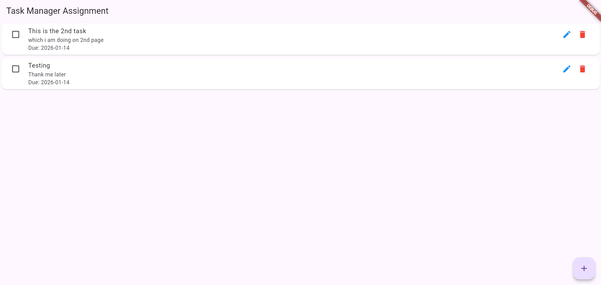
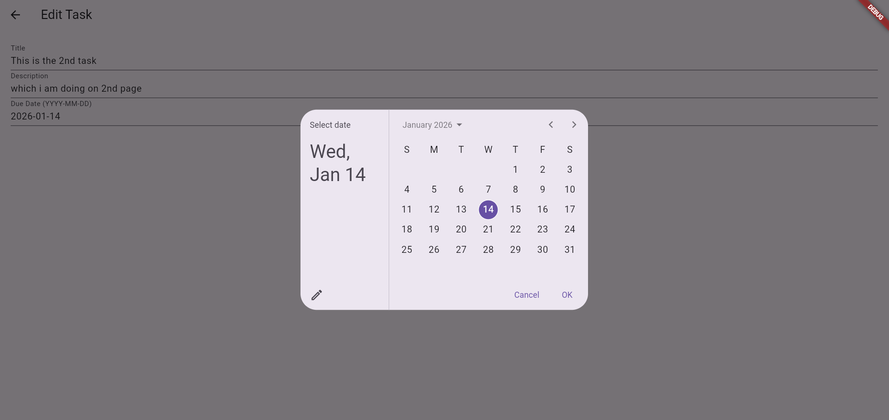
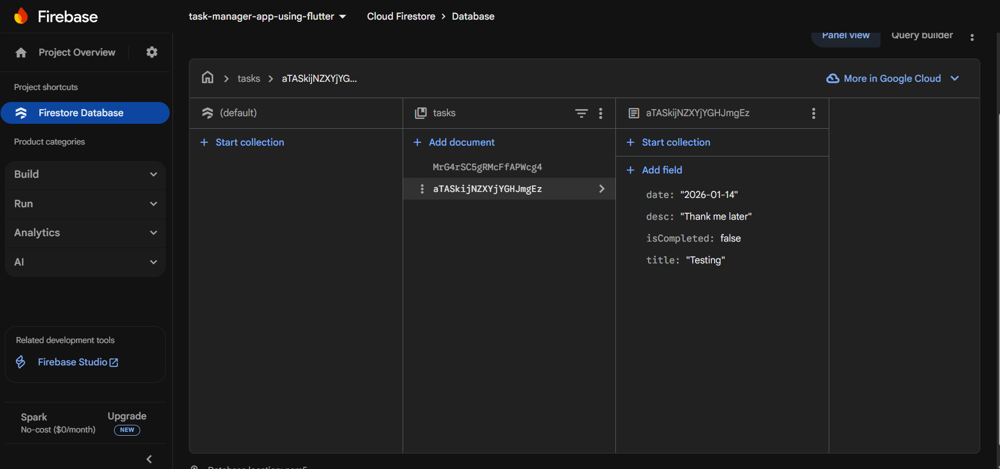

# Task Manager App (Flutter + Firebase)

<p align="center">
A full-stack cross-platform Task Manager application built with Flutter and Firebase, featuring real-time synchronization, CRUD operations, and cloud-based state management.
</p>

---

## Badges

<p align="left">
  
  
  
  
</p>

---

## Project Overview

The **Task Manager App** is designed to provide a clean and efficient interface for managing daily tasks.  
It leverages **Firebase Cloud Firestore** to ensure persistent data storage, real-time updates across devices, and a seamless cross-platform experience.

This project demonstrates strong fundamentals in Flutter UI development, cloud database integration, and real-time state synchronization.

---

## Features

- Real-time task synchronization using Firestore streams
- Create tasks with title, description, and due date
- Edit existing tasks
- Delete tasks permanently from the database
- Mark tasks as Completed or Pending
- Cross-platform support for Android and Web

---

## Screenshots

### Home Screen – Task List
Displays all tasks with real-time updates and completion status.



---

### Create Task Screen
Interface for adding a new task with title, description, and due date.



---

### Firebase Firestore Console
Real-time task data stored and synchronized using Cloud Firestore.



---

## Demo Video

### Full App Walkthrough

```text
videos/task_manager_demo.mp4
````

---

## Tech Stack

| Layer            | Technology                       |
| ---------------- | -------------------------------- |
| Frontend         | Flutter (Dart)                   |
| Backend          | Firebase Cloud Firestore (NoSQL) |
| State Management | Streams & setState               |
| Platforms        | Android, Web                     |

---

## Dependencies

* firebase_core
* cloud_firestore
* intl

---

## Installation & Setup

### Clone the Repository

```bash
git clone https://github.com/Muhammad-Adnan-Dev/Task-Manager-App-Flutter-and-firebase.git
cd Task-Manager-App-Flutter-and-firebase
```

---

### Install Dependencies

```bash
flutter pub get
```

---

### Firebase Configuration

#### Android

1. Create a project in the Firebase Console
2. Add an Android app using your package name (android/app/build.gradle)
3. Download google-services.json
4. Place it in android/app/
5. Enable Firestore in Test Mode for development

---

#### Web

Firebase web configuration keys are already included in main.dart.
No additional setup is required.

---

### Run the Application

**Android Emulator**

```bash
flutter run
```

**Web (Chrome)**

```bash
flutter run -d chrome
```

---

## Folder Structure

```text
lib/
 └── main.dart
android/
screenshots/
videos/
pubspec.yaml
```

---

## License

This project is licensed under the MIT License.

---

## Author

**Muhammad Adnan**
GitHub: [https://github.com/Muhammad-Adnan-Dev](https://github.com/Muhammad-Adnan-Dev)

```
```
